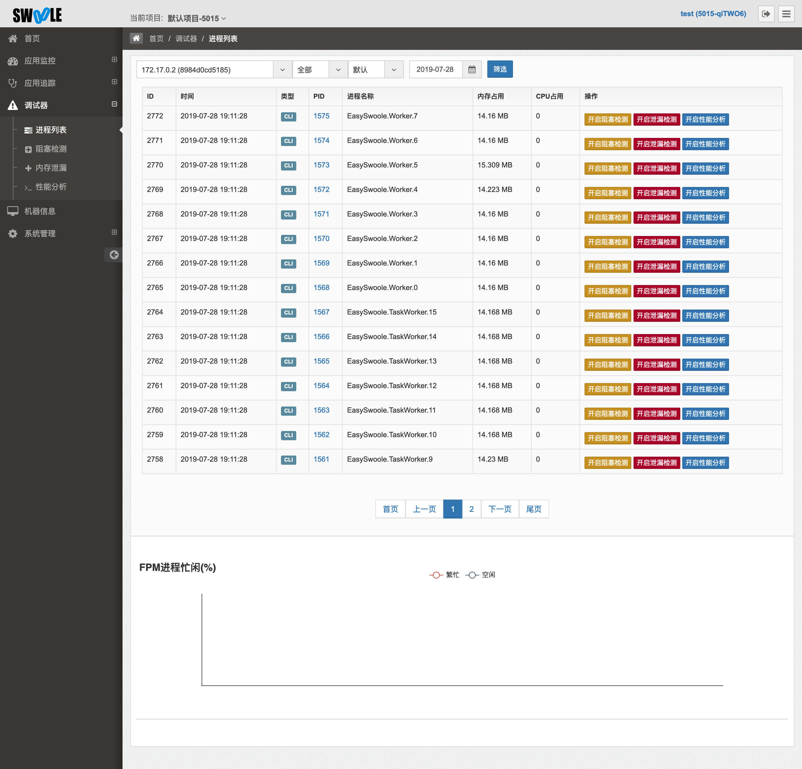
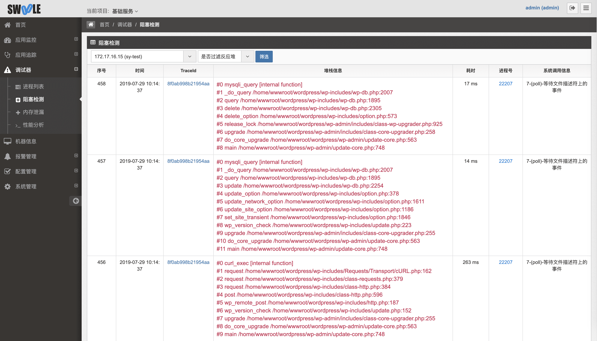
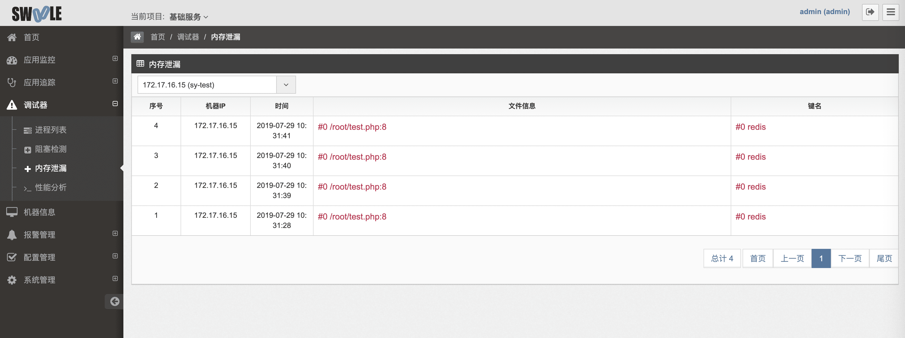

# Swoole Tracker

[Swoole Tracker](https://www.swoole-cloud.com/tracker.html)是Swoole官方出品的一整套企业级PHP和Swoole分析调试工具，全面支持协程/非协程环境，数据实时可视化，并全面分析报告服务状况，快速发现及精准定位问题和性能瓶颈。
在安装好swoole_tracker扩展后，我们可以在EasySwoole中提供的各个事件当中埋点，进行应用监控。

> 安装swoole_tracker扩展的方法见安装文档 https://www.kancloud.cn/swoole-inc/ee-base-wiki/1214079#_24 ，并且可以在 https://www.swoole-cloud.com/ 得到支持，若需要进行定制化本地部署，请联系框架作者或者是Swoole官方客服。

## 效果图

### 应用监控


### 调试器-进程列表


> 以下为企业版中的调试工具链功能，通过PID远程开启调试，支持检测阻塞IO、内存泄漏和代码性能分析

### 调试器-阻塞检测


### 调试器-内存泄漏检测


### 调试器-性能分析


### 接口监控


## 启动

在安装好swoole_tracker扩展后，我们执行：
```
/opt/swoole/script/php/swoole_php /opt/swoole/node-agent/src/node.php & php easyswoole start
```
即可对EasySwoole进行监控。

## Http服务监控

### 全局监控

EasySwooleEvent.php中，分别对 onRequest,afterResponse两个事件进行注册

- onRequest事件

```
public static function onRequest(Request $request, Response $response): bool
{
    $tick = \Tracker\Stats::beforeExecRpc($request->getUri()->getPath(), 'serviceName', "192.168.0.1");
    /*
        把该次请求生成的tick托管给上下文管理器
    */
    ContextManager::getInstance()->set("SWOOLE_PLUS_TICK",$tick);
    return true;
}
```
- afterRequest事件

```
public static function afterRequest(Request $request, Response $response): void
{
    $tick = ContextManager::getInstance()->get('SWOOLE_PLUS_TICK');
    if($response->getStatusCode() != 200){
        $ret = false;
    }else{
       $ret = true;
    }
    \Tracker\Stats::afterExecRpc($tick, $ret, $response->getStatusCode());
}
```

注册完以上事件后，即可自动的把http服务的全部链路信息自动上报至swoole企业监控平台。


### Http分组监控

若需要对Http服务做细化的分组监控，我们可以定义一个Base控制器。
```
class Base extends Controller
{
    public $tick;
    
    function onRequest(?string $action): ?bool
    {
        $this->tick = \Tracker\Stats::beforeExecRpc($request->getUri()->getPath(), 'myGroupName', "192.168.0.1");
        return true;
    }
    
    function afterAction(?string $actionName): void
    {
        \Tracker\Stats::afterExecRpc($tick, true, 200);
        $this->tick = null;
    }
}
```

例如全部的Api控制器需要监控，那么对于的控制器继承对应的Base控制器即可。


## Rpc、Tcp、WebSocket服务监控

Easyswoole的Rpc、Tcp、WebSocket服务也同理提供了onRequest，afterAction方法，对两个方法进行埋点，即可实现对应的监控。
