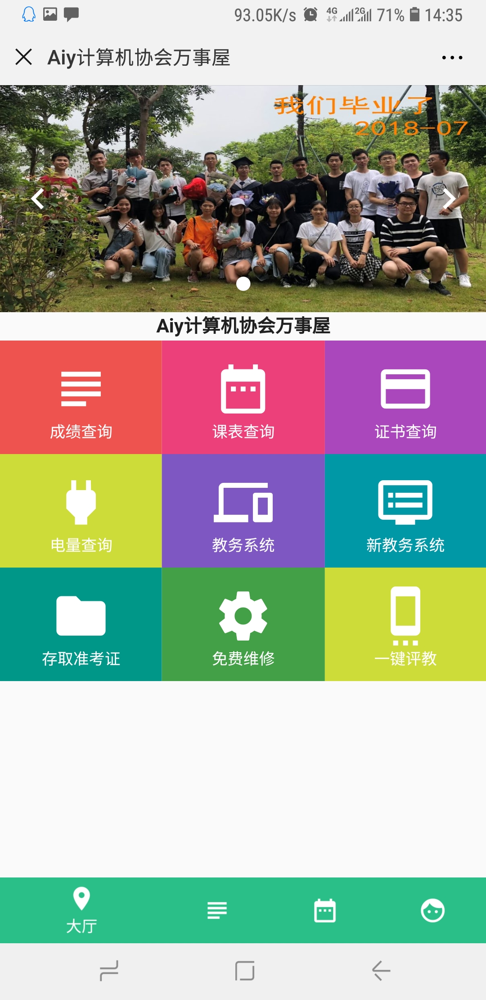

# EasySwoole 项目案例

## FaShop(综合商城+小程序)

FaShop 
- 基于EasySwoole开发的开源商城系统，第一版本发布于2018年9月20日；
- 前后端分离，所有客户端基于公用API开发；
- 目前客户端有微信小程序、APP；
- 可通过拖拽生成小程序和APP页面；
- 商城基础功能包含：商品SKU、订单、退款退货、购物车、一键购买、地址管理、评价管理、拖拽页面管理等；
- 正在开发的功能有：拼团、分销、优惠券、满减、赠品、秒杀；
- 目的：打造一款运营手段丰富、用户体验不错的免费商城系统，后期希望能通过一些附加服务来盈利，实现盈利后增加投入继续打磨产品。

项目地址：https://www.fashop.cn/

## E城通智能充电系统(硬件互联)

e城通智能充电系统（即充电桩，于2017年6月上线，基于EasySwoole开发，微信搜索关注 "e城通智能充电系统" 可以体验

## 深圳信息职业技术学院计算机协会(综合服务-智能电表硬件互联)

