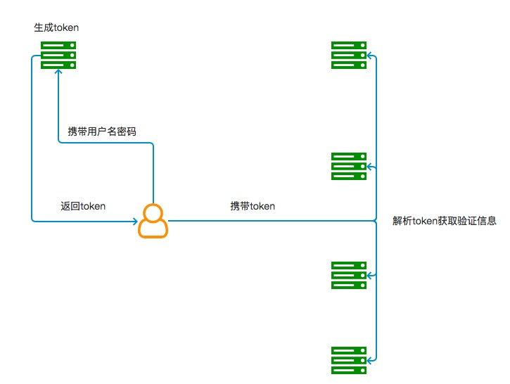

# Jwt

JSON Web Token（JWT）是目前最流行的跨域身份验证解决方案。
随着技术的发展，分布式web应用的普及，通过session管理用户登录状态成本越来越高，因此慢慢发展成为token的方式做登录身份校验，然后通过token去取redis中的缓存的用户信息，随着之后jwt的出现，校验方式更加简单便捷化，无需通过redis缓存，而是直接根据token取出保存的用户信息，以及对token可用性校验，单点登录更为简单。

::: warning 
[建议阅读一下](https://baijiahao.baidu.com/s?id=1608021814182894637&wfr=spider&for=pc)
:::

## Jwt架构图

 )
