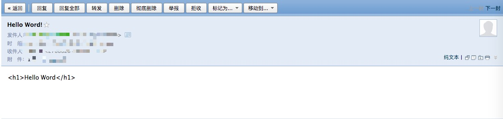
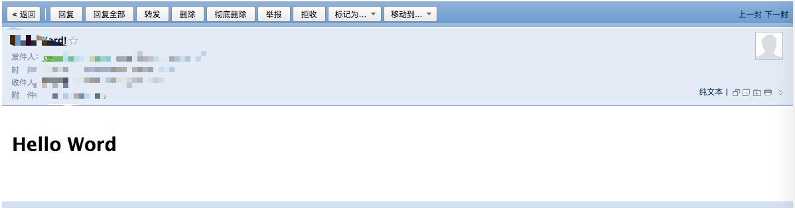

# 邮件内容

支持文本和html两种类型

## 文本

#### 示例
```php
$mimeBean = new \EasySwoole\Smtp\Message\Text();
$mimeBean->setSubject('Hello Word!');
$mimeBean->setBody('<h1>Hello Word</h1>');
```

#### 效果
 

## Html
```php
$mimeBean = new \EasySwoole\Smtp\Message\Html();
$mimeBean->setSubject('Hello Word!');
$mimeBean->setBody('<h1>Hello Word</h1>');
```

#### 效果
 

## 附件
```php
$mimeBean = new \EasySwoole\Smtp\Message\Text();
//$mimeBean = new \EasySwoole\Smtp\Message\Html();

...

// 创建附件
$createAttachment = Attach::create('./test.txt');

// 添加附件
$mimeBean->addAttachment($createAttachment);

...
```

