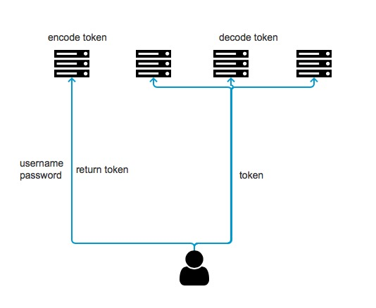

# Jwt

JSON Web Token（JWT）Is the most popular cross domain authentication solution.
With the development of technology and the popularization of distributed web applications, the cost of managing users' login status through session is getting higher and higher, so it gradually develops into a token method to do login identity verification, and then through token to get the cached user information in redis. With the emergence of JWT, the verification method is more simple and convenient, without redis caching, but directly based on the token Single sign on is easier to save user information and check the availability of token.

 )
