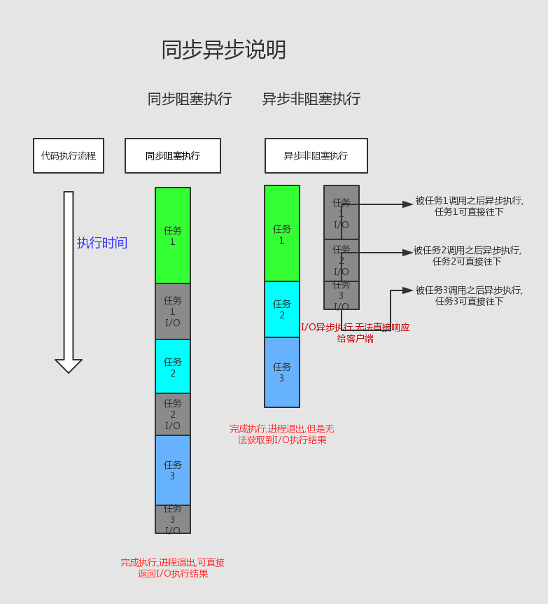

## 进程阻塞  
正在运行的进程由于提出系统服务请求（如I/O操作），但因为某种原因未得到操作系统的立即响应，或者需要从其他合作进程获得的数据尚未到达等原因，该进程只能调用阻塞原语把自己阻塞，等待相应的事件出现后才被唤醒。

### 阻塞状态

正在进行的进程由于发生某事件而暂时无法继续执行时，便放弃处理机而处于暂停状态，亦即进程的执行受到阻塞，我们把这种暂停状态叫阻塞进程阻塞，有时也成为等待状态或封锁状态。通常这种处于阻塞状态的进程也排成一个队列。有的系统则根据阻塞原因的不同而处于阻塞状态进程排成多个队列。  

例如:    
用户访问服务端,请求用户的个人的订单信息,由于数据库数据量大,数据库繁忙,sql语句查询了3秒才返回,这个查询数据库的过程,就是可称为是"阻塞的".(进程调用外部逻辑)   


>阻塞这个概念和时间关系不大,就算查了0.1秒,也可以说是阻塞了0.1秒,因为这个并不是进程本身执行所消耗的时间,而是因为查询数据库,等待数据库响应消耗的时间.
>但阻塞的危害性和时间有关,阻塞0.1秒对于用户是没有任何问题的,但是阻塞10秒将会使用户体验下降很多,所以我们需要重视阻塞
>
>  用户访问服务端,由于某个地方调用了死循环或多重循环浪费了许多时间,无法继续往下执行,这个状态也可称为阻塞.(非进程阻塞,可自行避免)  
>非进程阻塞 在进程阻塞层面中,并不算是被阻塞了,因为它依旧在执行进程中的代码,没有等待清空

### 阻塞函数
如上所说,调用数据库等外部逻辑,造成阻塞的函数,就叫做阻塞函数
    
### php中的阻塞
在php初级开发者中,或许没有听过这个概念,阻塞往往是和"同步"概念一起存在的,例如查询数据库,获取文件数据,请求其他网站,等等,只要需要消耗非进程本身执行时间并需要进程等待(同步)的,都可以说是阻塞.
>几乎所有的阻塞,都是与I/O有关.  
>阻塞一定是同步代码调用阻塞函数才会阻塞,但同步代码不一定会阻塞(不调用阻塞函数的同步代码)
```php
<?php
$num = 30;
$result = M('test')->select();//伪代码,sql阻塞
sleep(3);//伪代码,当成执行了3秒才返回
echo json_encode($result);//返回数据
```

可自行搜索了解更多

### 非阻塞
非阻塞,顾名思义,就是在进程在运行中,不存在阻塞情况,一直能往下执行.
>非阻塞一般是指调用I/O操作时,进程无需等待I/O操作,直接往下执行的情况
>非阻塞通常是和"异步"概念一起存在,只要是异步获取I/O,就一定是非阻塞   
>异步调用I/O一定是非阻塞的,但非阻塞不一定需要异步调用才可实现(非阻塞模型)

例如:  
当查询数据库时,马上返回状态(查询到了就返回数据,数据还没到就返回-1),程序可以立即往下执行逻辑.  
>这种马上返回结果,无需等待(并不一定有数据)的函数,就叫做非阻塞函数,也可称为是"异步调用"


### 非阻塞模型
可以通过非阻塞模型去实现非阻塞(主要针对于server服务端实现).
详细了解可查看:http://www.php20.cn/article/157

### php中的非阻塞  
php初级开发者中,很少有非阻塞这个概念存在,但php是有非阻塞的,例如socket_set_nonblock()函数,将socket改为非阻塞状态   
通过flock($file,LOCK_EX|LOCK_NB),可将文件操作设置为非阻塞状态  
可自行搜索了解详细  

### 非阻塞注意事项
由于非阻塞的返回结果是不确定的,当我们需要关心返回结果的情况时,需要确保返回结果是正确的(例如while(1){}定时查询,当数据正确返回退出循环),或者直接使用阻塞函数

### 阻塞和非阻塞的举例  
阻塞:  
小明去电脑店买Mac,问店员现在有没有MacBook Pro版本,有多少台,店员告诉小明,"我得去查一查,你得等等",小明站在店门口等了2天,店员回来了,告诉小明,现在有10台,然后小明买了一台.
>在这个过程中,店员查询是否有mbp的动作,就属于I/O操作,叫小明等等这个操作,就是阻塞情况,小明等了2天,就说明查询mbp时间为2天,阻塞了2天,店员回来告诉小明有10台,就是阻塞函数出现了结果,并返回了数据,小明买了一台,就是继续往下执行了代码

非阻塞:
小明去电脑店买Mac,问店员现在有没有MacBook Pro版本,有多少台,店员告诉小明,"我得去查一查,你先回去呗",小明回家,每隔10分钟打电话给店员,但是店员每次都告诉他还没查到,小明每次打完电话就去敲PHP代码,2天后,小明打完一把LOL,又打电话给店员问,店员告诉小明,现在有10台了,然后小明买了一台.

>在这个过程中,店员查询是否有mbp的动作,就属于I/O操作,叫小明回家这个操作,就是非阻塞情况,小明不断打电话,这个就是定时轮询查询,店员不断的回复,这个情况就是非阻塞函数没有返回数据,小明去敲PHP,说明非阻塞情况还能执行其他代码,2天后,店员回来告诉小明有10台,就是非阻塞函数通过轮询出现了结果,并返回了数据,小明买了一台,就是退出了循环继续往下执行了代码



